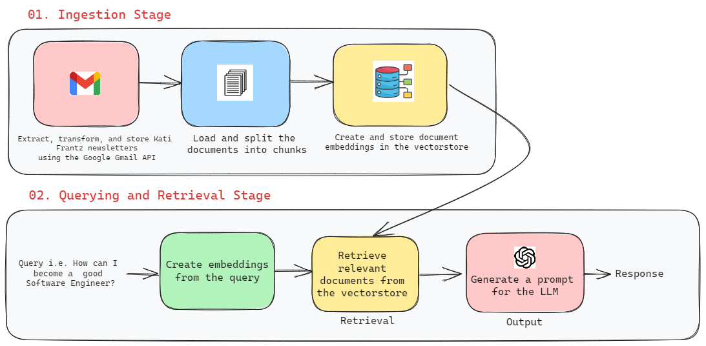

# Chat with Kati Frantz

## Background Story

I have been receiving Kati Frantz's newsletters for a few months now and it has become something I look forward to weekly because of the practical ideas and invaluable advice it offers. This app provides a way to perform an LLM-powered QA over the "golden nuggets" shared in those newsletters, using `LangChain` and the `OpenAI API`.

## How it works?

The app works by performing question-answering over the content of the newsletter mails sent by Kati Frantz using LLMs. Firstly, the required data is fetched from Gmail using the [Google Gmail API](https://developers.google.com/gmail/api/guides), then transformed and stored locally in `.txt` files. The stored documents are loaded, split, and a vector store (`Pinecone`) is used to store the embeddings generated using `OpenAI`.

When a query is sent to the application, the relevant documents to the query are retrieved from the vector store and passed as a context to the LLM to generate a desired response.

A visual illustration is shown below:



A comprehensive review of the pipeline for performing QA over documents in `LangChain` is available [HERE](https://python.langchain.com/docs/use_cases/question_answering/).

## Relevant scripts

- `./email-extractor`: contains the Python script for automatically extracting, transforming, and storing the newsletters using [Google Gmail API](https://developers.google.com/gmail/api/guides).

- `./scripts/create-pinecone-index.ts`: Script for creating the pinecone index

- `./scripts/ingest-data.ts`: Script for loading the documents, creating the embeddings and storing in Pinecone

## Running the app

1. Clone the repository

```bash
$ git clone https://github.com/rexsimiloluwah/nextjs-llm-apps.git
$ cd nextjs-llm-apps
```

2. Install dependencies

```bash
$ npm install
# or
$ pnpm install
# or
$ yarn install
```

3. Run the development server

```bash
$ npm run dev
# or
$ pnpm run dev
# or
$ yarn dev
```

Go to `http://localhost:3000/chat-with-kati` to use locally.

### Example API Usage

```bash
$ curl  -X POST \
  'http://localhost:3000/api/chat-with-kati' \
  --header 'Accept: */*' \
  --header 'Content-Type: application/json' \
  --data-raw '{
  "question": "How can I become a better software engineer?",
  "history":[]
}'
```
